# 第六章 多元函数微分学

## 6.1 n维欧式空间

### 球形邻域、方形邻域、内点、开集、闭集、边界点、开区域（连通的开集）、闭区域、有界集、无界集、直径

### 柯西收敛准则、闭矩形套收敛准则、致密性定理

## 6.2 多元函数的极限与连续

### 一致连续、有界性、最值性、介值性

### 典型题

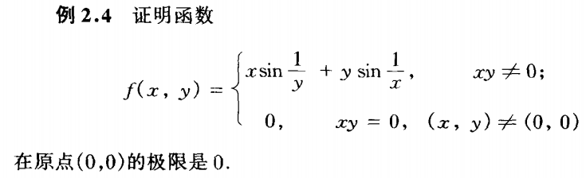

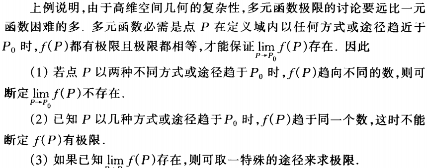

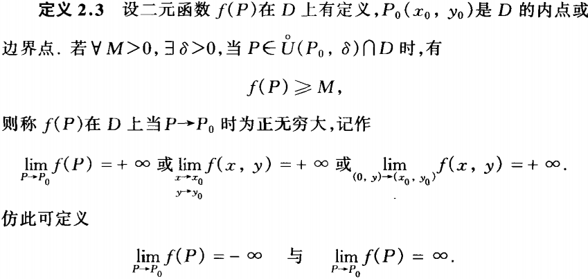

## 6.3 偏导数和全微分

### 偏改变量、偏导数

### 全微分：如果函数可微，那么我们就把那个最好的线性近似部分 \( A\Delta x + B\Delta y \) 定义为函数在该点的全微分

#### 全改变量：\(\Delta z = f(x_0 + \Delta x, y_0 + \Delta y) - f(x_0, y_0)\)

#### 可微的条件：\(\Delta z = A\Delta x + B\Delta y + o(\rho)\)

#### 全微分的定义： \( dz|_{(x_0,y_0)} = A\Delta x + B\Delta y \)

### 可微的必要条件：如果函数 \( z = f(x, y) \) 在点 \( (x_0, y_0) \) **可微**，那么它在该点**一定存在**两个偏导数 \( f‘_x(x_0, y_0) \) 和 \( f’_y(x_0, y_0) \)，并且全微分表达式 \( dz = A\Delta x + B\Delta y \) 中的 A 就是偏导数 \( f‘_x \)，B 就是偏导数 \( f’_y \)

### 可微的充分条件：如果函数 \( z = f(x, y) \) 的偏导数 \( f‘_x \) 和 \( f’_y \) 在点 \( (x_0, y_0) \) 的某个邻域内都存在，并且这两个偏导数在点 \( (x_0, y_0) \) 本身是连续的，那么函数在该点**一定可微

### 偏导数连续是函数可微的充分不必要条件

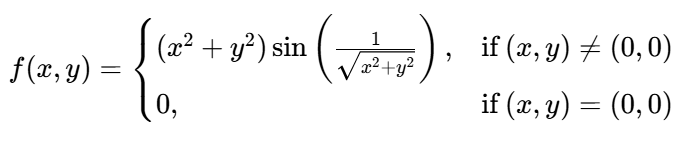

## 6.4 方向导数和梯度

### 方向导数：如果函数 \( u = f(x, y, z) \) 在点 \( P_0(x_0, y_0, z_0) \) 可微，那么函数在该点沿**任一方向** \( \boldsymbol{l} \) 的方向导数都存在，并且可以用以下公式计算

\[
\frac{\partial f}{\partial \boldsymbol{l}}\bigg|_{P_{0}} = \frac{\partial f}{\partial x}\bigg|_{P_{0}} \cos \alpha + \frac{\partial f}{\partial y}\bigg|_{P_{0}} \cos \beta + \frac{\partial f}{\partial z}\bigg|_{P_{0}} \cos \gamma
\]

其中 \( (\cos \alpha, \cos \beta, \cos \gamma) \) 是方向 \( \boldsymbol{l} \) 的方向余弦

### 梯度：$$ \left(f_{1}^{\prime}, f_{2}^{\prime}, f_{3}^{\prime}\right)\mid _{P_{0}} $$

## 6.5 复合函数微分法和高阶偏导数

### 链式法则

### 克莱罗定理定理：如果函数 \( f(x, y) \) 在点 \( P_0(x_0, y_0) \) 的某个邻域内存在二阶混合偏导数并且这两个混合偏导数在点 \( P_0 \) 处连续，那么它们在该点必然相等

\[
f_{xy}''(x_0, y_0) = f_{yx}''(x_0, y_0)
\]

### 拉普拉斯算子:Δ = ∂²/∂x² + ∂²/∂y² + ∂²/∂z²

## 6.6多元泰勒公式与极值

### 展开式

函数 \( f(x, y) \) 在点 \( (x_0, y_0) \) 附近的泰勒级数展开为：
$$f(x, y) = \sum_{m=0}^{\infty} \frac{1}{m!} \left[ h \frac{\partial}{\partial x} + k \frac{\partial}{\partial y} \right]^m f(x_0, y_0)$$
其中，\( h = x - x_0 \)，\( k = y - y_0 \)。

### 二元中值定理

$$f(x_0 + h, y_0 + k) - f(x_0, y_0) = f'_x(x_0 + \theta h, y_0 + \theta k) \ h + f'_y(x_0 + \theta h, y_0 + \theta k) \ k$$

### 极值必要条件：驻点

### 极值充分条件：B²-AC

设函数 $z = f(x, y)$ 在点 $P_0(x_0, y_0)$ 的某邻域内具有二阶连续偏导数，且 $P_0$ 是函数的**驻点**（即满足 $f_x'(P_0) = 0$, $f_y'(P_0) = 0$）。

$$
f_{xx}''(P_0) = A, \quad f_{xy}''(P_0) = B, \quad f_{yy}''(P_0) = C
$$

| 判别式 $\Delta$ 的情况 | 结论 |
| :--- | :--- |
| **(1) 当 $\Delta < 0$ 时** | $P_0$ 是**极值点**。 |
| &nbsp;&nbsp; • 若 $A < 0$ (或 $C < 0$) | $P_0$ 是**极大值点**。 |
| &nbsp;&nbsp; • 若 $A > 0$ (或 $C > 0$) | $P_0$ 是**极小值点**。 |
| **(2) 当 $\Delta > 0$ 时** | $P_0$ **不是极值点**（是一个**鞍点**）。 |
| **(3) 当 $\Delta = 0$ 时** | **方法失效**，无法用此法判断，需借助其他方法（如极值定义或更高阶导数）。 |

## 6.7隐函数存在定理及其微分法

### 隐函数存在定理：对于一个二元方程 \( F(x, y) = 0 \)，若满足以下条件，则可确定一个隐函数 \( y = f(x) \)

1. 光滑性条件：函数 \( F(x, y) \) 在点 \( P_0(x_0, y_0) \) 的某个邻域内具有连续的偏导数。

2. 初始条件：点 \( P_0 \) 满足原方程，即 \( F(x_0, y_0) = 0 \)。
3. 非退化条件：函数在 \( P_0 \) 点关于 \( y \) 的偏导数不为零，即 \( F'_y(x_0, y_0) \neq 0 \)。

如果上述条件成立，则有如下结论：
存在性与唯一性：在点 \( P_0 \) 的某个邻域内，方程 \( F(x, y) = 0 \) 唯一地确定了一个定义在 \( x_0 \) 某邻域内的函数 \( y = f(x) \)。
函数值：该函数满足初始条件 \( f(x_0) = y_0 \)。
光滑性：函数 \( y = f(x) \) 是连续可微的（即其导数存在且连续）。
导数公式：即使函数 \( f(x) \) 的具体解析式难以求出，其导数也可由以下公式计算：

$$
\frac{dy}{dx} = f'(x) = - \frac{F'_x(x, y)}{F'_y(x, y)}
$$

### 反函数求导（何来正反）

## 6.8条件极值：拉格朗日数乘法

## 6.9空间曲线

### 切线和法平面（线）

$$
\frac{x - x_0}{x'(t_0)} = \frac{y - y_0}{y'(t_0)} = \frac{z - z_0}{z'(t_0)} \tag{9.3}
$$

$$
 x'(t_0)(x - x_0) + y'(t_0)(y - y_0) + z'(t_0)(z - z_0) = 0 
$$

### 切平面和法线（面）

$$
\dfrac{\partial F}{\partial x}(P_0)(x - x_0) + \dfrac{\partial F}{\partial y}(P_0)(y - y_0) + \dfrac{\partial F}{\partial z}(P_0)(z - z_0) = 0 
$$

$$
\dfrac{x - x_0}{\dfrac{\partial F}{\partial x}(P_0)} = \dfrac{y - y_0}{\dfrac{\partial F}{\partial y}(P_0)} = \dfrac{z - z_0}{\dfrac{\partial F}{\partial z}(P_0)}
$$

### 曲率

\[
\frac{d\phi}{ds} = \frac{ y'' }{ \left(1 + (y')^2\right)^{3/2} }
\]

# 第七章 多元函数的积分学

## 7.1 流形上的积分

### 积分中值定理、二重积分、三重积分

### 第一型曲线积分

$$
\int_{L} f(x, y)  d s = \int_{a}^{b} f(x, y(x)) \cdot \sqrt{1 + \left[ y'(x) \right]^{2}}  d x
$$

### 第一型曲面积分

\[
  \iint_S f(x, y, z) \, dS = \iint_D f(x, y, z(x, y)) \sqrt{1 + \left( \frac{\partial z}{\partial x} \right)^2 + \left( \frac{\partial z}{\partial y} \right)^2} \, dx \, dy。
\] 

### 换元积分法

$$
\iint_{D} f(x, y) \, dx \, dy = \iint_{D'} f(x(u, v), y(u, v)) \cdot \left| \frac{\partial(x, y)}{\partial(u, v)} \right| \, du \, dv
$$

# 第八章 向量值函数的积分

## 8.1 第二型曲线积分

$$
W = \int_{c} \mathbf{F} \cdot d\mathbf{l} = \int_{c} P(x, y, z)  dx + Q(x, y, z)  dy + R(x, y, z)  dz
$$

## 8.2 格林公式

### 若函数 $P(x, y)$, $Q(x, y)$ 以及 $\frac{\partial P}{\partial y}$, $\frac{\partial Q}{\partial x}$ 在光滑或逐段光滑的简单闭曲线 $c$ 所围成的闭区域 $D$ 上连续，则

$$
\oint_{c} P(x, y) d x+Q(x, y) d y=\iint_{D}\left( \frac{\partial Q}{\partial x}- \frac{\partial P}{\partial y}\right) d \sigma
$$

## 8.3 曲线积分与路径无关

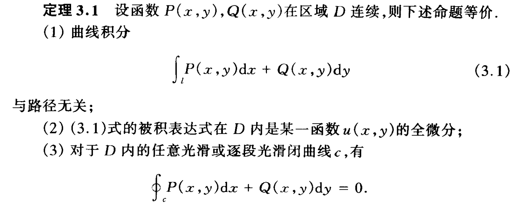

## 8.4 全微分方程

如果一阶微分方程

$$ P(x,y)dx+Q(x,y)dy=0 $$

的左端恰好是某一函数u(x,y)的全微分，则称该方程为全(恰当)微分方程。

## 8.5 第二型曲面积分

$$
\iint_{S}\mathbf{F}\cdot d\mathbf{S}=\iint_{S}(P dydz+Qdzdx+Rdxdy)
$$

## 8.6 奥-高公式

设三维空间 $R^3$ 中的有界闭区域 $\Omega$ 是由光滑的闭曲面 $S$ 所围成，函数 $P$, $Q$, $R$ 及其偏导数在 $\Omega$ 上连续，则
$$
\oiint\limits_{S} Pdy \wedge dz + Qdz \wedge dx + Rdx \wedge dy = \iiint_{\Omega} \left( \frac{\partial P}{\partial x} + \frac{\partial Q}{\partial y} + \frac{\partial R}{\partial z} \right) dV = \iint_{S} (P\cos \alpha + Q\cos \beta + R\cos \gamma)  dS
$$
其中曲面 $S$ 取外侧。

## 8.7 斯托克斯公式（一点也看不懂）

设光滑的开曲面S的边界是光滑或逐段光滑闭曲线c, 函数P, Q, R及其偏导数在曲面S上连续, 则
$$ 
\oint_{c} P d x+Q d y+R d z=\iint_{S}\left(\frac{\partial R}{\partial y}-\frac{\partial Q}{\partial z}\right) d y \wedge d z +\left(\frac{\partial P}{\partial z}-\frac{\partial R}{\partial x}\right) d z \wedge d x+\left(\frac{\partial Q}{\partial x}-\frac{\partial P}{\partial y}\right) d x \wedge d y 
$$

这里曲面S的正侧与曲线c的正向构成右手系.

## 重要结论

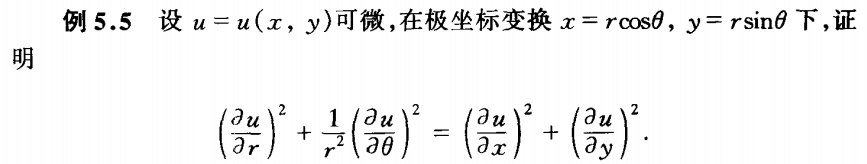

------------------------------------------------

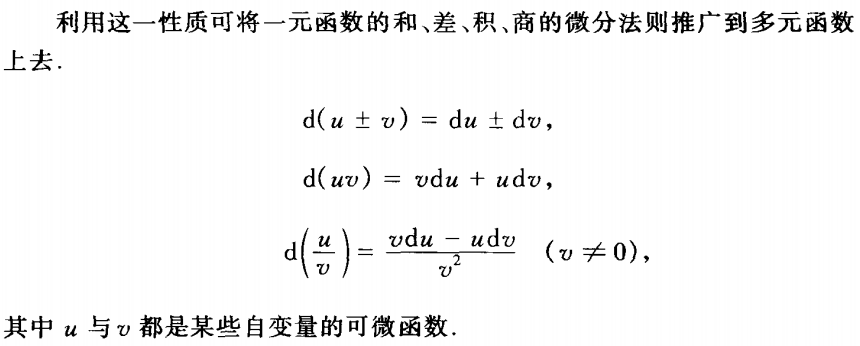

------------------------------------------------
**高阶全微分**
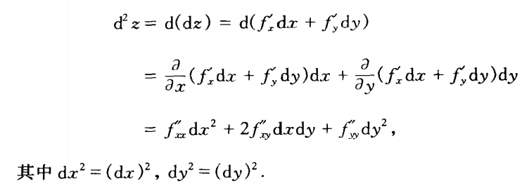

------------------------------------------------
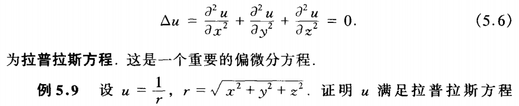

------------------------------------------------
**隐函数求导**
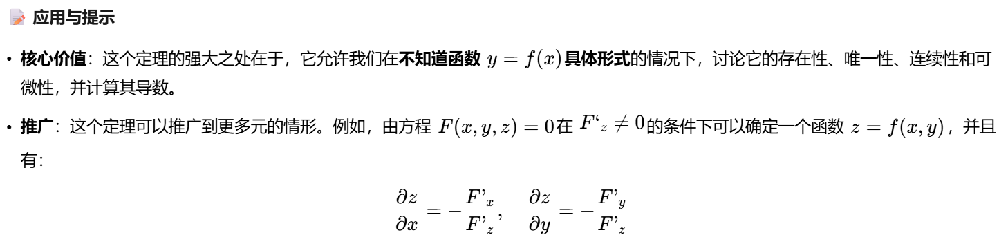

**积分换元**
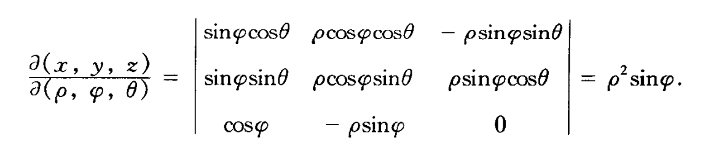
